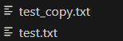

## 2-24
```C=
#include <fcntl.h>
#include <unistd.h>
#include <stdio.h>
#include <stdlib.h>

#define BUFFER_SIZE 1024

int main() {
    char srcFileName[256], destFileName[256];
    int srcFd, destFd, readBytes;
    char buffer[BUFFER_SIZE];

    printf("Enter source file name: ");
    scanf("%255s", srcFileName);
    printf("Enter destination file name: ");
    scanf("%255s", destFileName);

    srcFd = open(srcFileName, O_RDONLY);
    if (srcFd == -1) {
        perror("Error opening source file");
        return 1;
    }

    destFd = open(destFileName, O_WRONLY | O_CREAT | O_TRUNC, 0644);
    if (destFd == -1) {
        perror("Error creating destination file");
        close(srcFd);
        return 1;
    }

    while ((readBytes = read(srcFd, buffer, BUFFER_SIZE)) > 0) {
        if (write(destFd, buffer, readBytes) != readBytes) {
            perror("Error writing to destination file");
            close(srcFd);
            close(destFd);
            return 1;
        }
    }

    if (readBytes == -1) {
        perror("Error reading from source file");
    }

    close(srcFd);
    close(destFd);

    return 0;
}

```


```cmd=
➜  OS strace ./Q2_24
execve("./Q2_24", ["./Q2_24"], 0x7ffd5cfc3690 /* 27 vars */) = 0      
brk(NULL)                               = 0x55d93a248000
arch_prctl(0x3001 /* ARCH_??? */, 0x7ffe48dc91e0) = -1 EINVAL (Invalid argument)
mmap(NULL, 8192, PROT_READ|PROT_WRITE, MAP_PRIVATE|MAP_ANONYMOUS, -1, 0) = 0x7fc2d040a000
access("/etc/ld.so.preload", R_OK)      = -1 ENOENT (No such file or directory)
openat(AT_FDCWD, "/etc/ld.so.cache", O_RDONLY|O_CLOEXEC) = 3
newfstatat(3, "", {st_mode=S_IFREG|0644, st_size=62143, ...}, AT_EMPTY_PATH) = 0
mmap(NULL, 62143, PROT_READ, MAP_PRIVATE, 3, 0) = 0x7fc2d03fa000      
close(3)                                = 0
openat(AT_FDCWD, "/lib/x86_64-linux-gnu/libc.so.6", O_RDONLY|O_CLOEXEC) = 3
read(3, "\177ELF\2\1\1\3\0\0\0\0\0\0\0\0\3\0>\0\1\0\0\0P\237\2\0\0\0\0\0"..., 832) = 832
pread64(3, "\6\0\0\0\4\0\0\0@\0\0\0\0\0\0\0@\0\0\0\0\0\0\0@\0\0\0\0\0\0\0"..., 784, 64) = 784
pread64(3, "\4\0\0\0 \0\0\0\5\0\0\0GNU\0\2\0\0\300\4\0\0\0\3\0\0\0\0\0\0\0"..., 48, 848) = 48
pread64(3, "\4\0\0\0\24\0\0\0\3\0\0\0GNU\0\302\211\332Pq\2439\235\350\223\322\257\201\326\243\f"..., 68, 896) = 68
newfstatat(3, "", {st_mode=S_IFREG|0755, st_size=2220400, ...}, AT_EMPTY_PATH) = 0
pread64(3, "\6\0\0\0\4\0\0\0@\0\0\0\0\0\0\0@\0\0\0\0\0\0\0@\0\0\0\0\0\0\0"..., 784, 64) = 784
mmap(NULL, 2264656, PROT_READ, MAP_PRIVATE|MAP_DENYWRITE, 3, 0) = 0x7fc2d01d1000
mprotect(0x7fc2d01f9000, 2023424, PROT_NONE) = 0
mmap(0x7fc2d01f9000, 1658880, PROT_READ|PROT_EXEC, MAP_PRIVATE|MAP_FIXED|MAP_DENYWRITE, 3, 0x28000) = 0x7fc2d01f9000
mmap(0x7fc2d038e000, 360448, PROT_READ, MAP_PRIVATE|MAP_FIXED|MAP_DENYWRITE, 3, 0x1bd000) = 0x7fc2d038e000
mmap(0x7fc2d03e7000, 24576, PROT_READ|PROT_WRITE, MAP_PRIVATE|MAP_FIXED|MAP_DENYWRITE, 3, 0x215000) = 0x7fc2d03e7000
mmap(0x7fc2d03ed000, 52816, PROT_READ|PROT_WRITE, MAP_PRIVATE|MAP_FIXED|MAP_ANONYMOUS, -1, 0) = 0x7fc2d03ed000
close(3)                                = 0
mmap(NULL, 12288, PROT_READ|PROT_WRITE, MAP_PRIVATE|MAP_ANONYMOUS, -1, 0) = 0x7fc2d01ce000
arch_prctl(ARCH_SET_FS, 0x7fc2d01ce740) = 0
set_tid_address(0x7fc2d01cea10)         = 1068
set_robust_list(0x7fc2d01cea20, 24)     = 0
rseq(0x7fc2d01cf0e0, 0x20, 0, 0x53053053) = 0
mprotect(0x7fc2d03e7000, 16384, PROT_READ) = 0
mprotect(0x55d93828f000, 4096, PROT_READ) = 0
mprotect(0x7fc2d0444000, 8192, PROT_READ) = 0
prlimit64(0, RLIMIT_STACK, NULL, {rlim_cur=8192*1024, rlim_max=RLIM64_INFINITY}) = 0
munmap(0x7fc2d03fa000, 62143)           = 0
newfstatat(1, "", {st_mode=S_IFCHR|0620, st_rdev=makedev(0x88, 0), ...}, AT_EMPTY_PATH) = 0
getrandom("\x56\xc4\x98\xdf\x72\x46\x5d\xc2", 8, GRND_NONBLOCK) = 8   
brk(NULL)                               = 0x55d93a248000
brk(0x55d93a269000)                     = 0x55d93a269000
newfstatat(0, "", {st_mode=S_IFCHR|0620, st_rdev=makedev(0x88, 0), ...}, AT_EMPTY_PATH) = 0
write(1, "Enter source file name: ", 24Enter source file name: ) = 24 
read(0, 0x55d93a2486b0, 1024)           = ? ERESTARTSYS (To be restarted if SA_RESTART is set)
--- SIGWINCH {si_signo=SIGWINCH, si_code=SI_KERNEL} ---
read(0,"\n", 1024)                     = 1
```

## 3-19
time_shm.c
```c=
#include <stdio.h>
#include <stdlib.h>
#include <sys/mman.h>
#include <fcntl.h>
#include <unistd.h>
#include <sys/wait.h>
#include <sys/time.h>


int main(int argc, char *argv[]) {
    if (argc < 2) {
        printf("Usage: %s <command>\n", argv[0]);
        return 1;
    }

    const char *name = "Time_Shared_Memory";
    const int SIZE = sizeof(struct timeval);
    int shm_fd = shm_open(name, O_CREAT | O_RDWR, 0666);
    ftruncate(shm_fd, SIZE);
    struct timeval *start = mmap(0, SIZE, PROT_READ | PROT_WRITE, MAP_SHARED, shm_fd, 0);

    pid_t pid = fork();
    if (pid == 0) { 
        gettimeofday(start, NULL);
        printf("1\n");
        execvp(argv[1], &argv[1]);
        
        exit(1);
    } else if (pid > 0) { 
        wait(NULL); 

        struct timeval end, elapsed;
        gettimeofday(&end, NULL);
        timersub(&end, start, &elapsed);

        printf("Elapsed Time: %ld.%06ld seconds\n", (long)elapsed.tv_sec, (long)elapsed.tv_usec);
        printf("2\n");
        munmap(start, SIZE);
        close(shm_fd);
        shm_unlink(name);
    } else {
        return 1;
    }

    return 0;
}

```

time_pipe.c
```c=
#include <stdio.h>
#include <stdlib.h>
#include <unistd.h>
#include <sys/wait.h>
#include <sys/time.h>

int main(int argc, char *argv[]) {
    if (argc < 2) {
        printf("Usage: %s <command>\n", argv[0]);
        return 1;
    }

    int fd[2];
    if (pipe(fd) == -1) {
        return 1;
    }

    pid_t pid = fork();
    if (pid == 0) {
        close(fd[0]);
        struct timeval start;
        gettimeofday(&start, NULL);
        write(fd[1], &start, sizeof(start));
        close(fd[1]);

        execvp(argv[1], &argv[1]);
        exit(1);
    } else if (pid > 0) {
        wait(NULL);
        close(fd[1]);

        struct timeval start, end, elapsed;
        read(fd[0], &start, sizeof(start));
        close(fd[0]);

        gettimeofday(&end, NULL);
        timersub(&end, &start, &elapsed);

        printf("Elapsed Time: %ld.%06ld seconds\n", (long)elapsed.tv_sec, (long)elapsed.tv_usec);
    } else {
        return 1;
    }

    return 0;
}

```


```cmd=
➜  OS gcc -o time_shm time_shm.c -lrt

➜  OS ./time_shm ls

'Chap01 (1).pptx'   Chap02.pptx   Chap03.pptx   Chap04.pptx   Chap05.pptx   HW1.md   HW1.ppt   Q2_24   Q2_24.c   time_pipe.c   time_shm   time_shm.c  '~$Chap02.pptx'
Elapsed Time: 0.002102 seconds
➜  OS gcc -o time_pipe time_pipe.c

➜  OS ./time_pipe ls

'Chap01 (1).pptx'   Chap03.pptx   Chap05.pptx   HW1.ppt   Q2_24.c     time_pipe.c   time_shm.c
 Chap02.pptx        Chap04.pptx   HW1.md        Q2_24     time_pipe   time_shm     '~$Chap02.pptx'
Elapsed Time: 0.002138 seconds
```

## 3-21
Collatz.c
```C=
#include <fcntl.h>
#include <unistd.h>
#include <stdio.h>
#include <stdlib.h>
#include <sys/wait.h>

int Collatz(int n)
{
    printf("%d\n",n);
    if(n==1){
        return 1;
    }
    if(n%2 == 1)
    {   
        return Collatz(n*3+1);
    }
    else if(n%2 == 0)
    {
        return Collatz(n/2);
    }

}
int main()
{
    int num=0;
    printf("Enter number:\n");
    scanf("%d",&num);
    
    pid_t pid = fork();
    if (pid == -1){
        perror("Error");
    }
    if (pid == 0) 
    {
        printf("Answer:\n");
        Collatz(num);
    }
    else if(pid > 0)
    {
        wait(NULL);
        printf("finish");
    }
    else 
    {
        return 1;
    } 
    return 0;

}
```
```cmd=
➜  HW1 git:(main) ✗ gcc -o Collatz Collatz.c
➜  HW1 git:(main) ✗ ./Collatz
Enter number:
35
Answer:
35
106
53
160
80
40
20
10
5
16
8
4
2
1
finish#  
```

## 3-27
copy_pipe.c
```c=
#include <fcntl.h>
#include <unistd.h>
#include <sys/wait.h>
#include <stdio.h>
#include <stdlib.h>

#define BUFFER_SIZE 1024


int main(int argc, char *argv[]){
    char srcFileName[256], destFileName[256];
    int srcFd, destFd, readBytes;
    char buffer[BUFFER_SIZE];


    if(argc<3)
    {
        printf("Usage: %s <srcFile> <desFile>\n", argv[0]);
        return 1;
    }
    int fd[2];
    if (pipe(fd) == -1) 
    {
        return 1;
    }

    pid_t pid = fork();
    if(pid < 0)
    {
        return 0;
    }
    else if (pid == 0) 
    {
        close(fd[0]);
        srcFd = open(argv[1], O_RDONLY);
        if (srcFd == -1) 
        {
            perror("Error opening source file");
            return 1;
        }

        
        while ((readBytes = read(srcFd, buffer, BUFFER_SIZE)) > 0)
        {
            write(fd[1], buffer, readBytes);
            
        }
        close(fd[1]);
        close(srcFd);

    }
    else if(pid > 0)
    {
        close(fd[1]); // 父进程不需要写入管道，关闭写端
        destFd = open(argv[2], O_WRONLY | O_CREAT | O_TRUNC, 0644);
        if (destFd == -1) 
        {
            perror("Error creating destination file");
            close(srcFd);
            return 1;
        }
        int destFd = open(argv[2], O_WRONLY | O_CREAT | O_TRUNC, 0644);
        if (destFd == -1) {
            perror("Error creating destination file");
            return 1;
        }

        char buffer[BUFFER_SIZE];
        ssize_t readBytes;
        while ((readBytes = read(fd[0], buffer, BUFFER_SIZE)) > 0) {
            write(destFd, buffer, readBytes);
        }
        close(destFd);
        close(fd[0]); // 读完数据后关闭读端

        wait(NULL); // 等待子进程结束
    }
    return 0;
}
```
```cmd=
➜  HW1 git:(main) ✗ gcc -o copy_pipe copy_pipe.c
➜  HW1 git:(main) ✗ ./copy_pipe test.txt test_copy.txt
➜  HW1 git:(main) ✗
```
