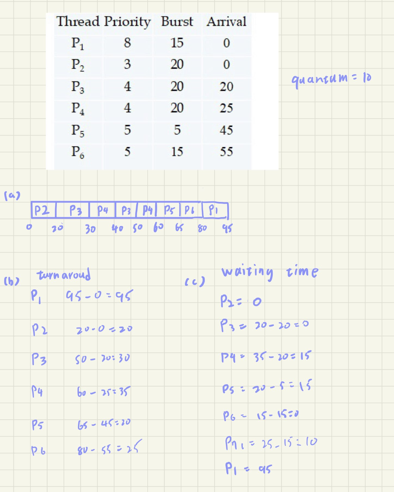

# 資工三 110590018 劉承翰

## 4-8

```cpp=
int ans = 0;
for(int i=0;i<10000;i++)
{
    ans+=i;
}
```
```cpp=
int fibonacci(int n) {
    if (n <= 1) return n;
    return fibonacci(n-1) + fibonacci(n-2);
}
```

## 4-10

B、C

## 4-16

1. one thread , because read one file just need one thread, more than one can't improve its performance

2. four threads , because it has four cores

## 5-14

- **Each processing core has its own run queue**

    - Advantages:

        1. Localization: 

            Each core working with its own queue can reduce contention among cores for the run queue.

        2. Cache affinity: 

            It can promote better cache locality because processes tend to stick to the same core, benefiting from the cache warm-up.

    - Disadvantages:

        1. Load Imbalance:

            If not managed properly, one core's queue might be overloaded while another is underutilized.

        2. Complexity in Load Balancing: 

            It requires a mechanism to balance the load across cores, which adds complexity.
- **A single Run Queue Shared by All Cores**
    - Advantages:

        1. Simpler Load Balancing: 
            Naturally balances the load across cores since a single queue is serving all cores.

        2. Simplicity: 
            Easier to implement because there is only one queue to manage.

    - Disadvantages:

        1. Concurrency Contention:

            High contention for the queue as multiple cores try to access and update it simultaneously.
    
        2. Cache Thrashing: 

            Higher likelihood of cache thrashing since a process might not run on the same core each time, leading to cache misses.


## 5-18

## 5-22
- **The time quantum is 1 millisecond**

    過度的切換會讓開銷變大，而CPU會用較多的資源處理context switch

- **The time quantum is 10 millisecond**

    較長的time_qauntum會讓schedule變成FCFS，因為一直都在計算I/O所以CPU使用率會較高

## 5-25

- **FCFS**

    先進先處理，假如short processes前面有 long processes，那他要先等長的完成才能執行

- **RR**

    雖然執行時間小於time_quantum的話可以很快完成，但假如有多個時間片段，會等很久

- **Multilevel feedback queues**

    因為有多個處理方法，而且每個RR的time_qauntum惠從小到大，這個特色可以讓short processes可以迅速完成

## 6-7

(a) top

(b) mutexes來限制當下只能做一個動作

## 6-15
Disabling interrupts is usually used in the kernel.

## 6-18

Semaphores can solve busy-waiting
