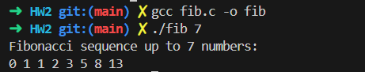

## 4-27
```c=
#include <pthread.h>
#include <stdio.h>
#include <stdlib.h>

// Shared array for Fibonacci numbers
int *fib_sequence;

// Thread function to generate Fibonacci numbers
void *fibonacci_thread(void *param) {
    int n = *(int *)param;
    if (n == 0) {
        fib_sequence[0] = 0;
        pthread_exit(0);
    } else if (n == 1) {
        fib_sequence[0] = 0;
        fib_sequence[1] = 1;
        pthread_exit(0);
    } else {
        fib_sequence[0] = 0;
        fib_sequence[1] = 1;
        for (int i = 2; i <= n; i++) {
            fib_sequence[i] = fib_sequence[i - 1] + fib_sequence[i - 2];
        }
    }
    pthread_exit(0);
}

int main(int argc, char *argv[]) {
    if (argc < 2) {
        printf("Usage: %s <n>\n", argv[0]);
        printf("where <n> is the number of Fibonacci numbers to generate.\n");
        return -1;
    }

    int n = atoi(argv[1]);
    if (n < 0) {
        printf("Please enter a non-negative integer.\n");
        return -1;
    }

    // Allocate memory for the Fibonacci sequence
    fib_sequence = malloc((n + 1) * sizeof(int));
    if (fib_sequence == NULL) {
        perror("Failed to allocate memory");
        return -1;
    }

    // Create the thread
    pthread_t thread;
    pthread_create(&thread, NULL, fibonacci_thread, &n);

    // Wait for the thread to finish
    pthread_join(thread, NULL);

    // Output the Fibonacci sequence
    printf("Fibonacci sequence up to %d numbers:\n", n);
    for (int i = 0; i <= n; i++) {
        printf("%d ", fib_sequence[i]);
    }
    printf("\n");

    // Free the allocated memory
    free(fib_sequence);

    return 0;
}

```


## 6-33

(a) available resources will be race condition

(b) in the decrease and increase function

(c)
```c=
#include <pthread.h>

#define MAX_RESOURCES 5
int available_resources = MAX_RESOURCES;
pthread_mutex_t mtx = PTHREAD_MUTEX_INITIALIZER;

// Function to decrease the count of available resources
int decrease_count(int count) {
    pthread_mutex_lock(&mtx);  // Lock the mutex
    while (available_resources < count) {  
        pthread_mutex_unlock(&mtx);  // Unlock mutex to allow other operations

        pthread_mutex_lock(&mtx);  // Re-lock the mutex when we retry
    }
    available_resources -= count;
    pthread_mutex_unlock(&mtx);  // Unlock the mutex
    return 0;
}

// Function to increase the count of available resources
int increase_count(int count) {
    pthread_mutex_lock(&mtx);  // Lock the mutex
    available_resources += count;
    pthread_mutex_unlock(&mtx);  // Unlock the mutex
    return 0;
}


```